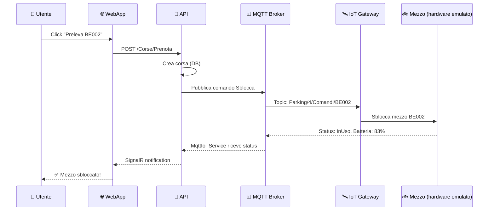

# 🏗️ Architettura IoT Gateway - Mobishare

## 📋 Panoramica

Questo documento descrive l'architettura refactorizzata per la gestione dei gateway IoT MQTT nel sistema Mobishare.

---

## ✅ Architettura Corretta (DOPO refactoring)

```
┌─────────────────────────────────────────────────────────────┐
│  🌐 Mobishare.WebApp (Port 7268)                           │
│  ┌───────────────────────────────────────────────────────┐  │
│  │  • Razor Pages (Frontend)                             │  │
│  │  • Autenticazione/Autorizzazione                      │  │
│  │  • Session Management                                 │  │
│  │  • SignalR Client (real-time notifications)          │  │
│  │  • HttpClient → chiama Mobishare.API                 │  │
│  └───────────────────────────────────────────────────────┘  │
└────────────────────────┬────────────────────────────────────┘
                         │ HTTPS (REST API calls)
                         ↓
┌─────────────────────────────────────────────────────────────┐
│  🔌 Mobishare.API (Port 7001)                              │
│  ┌───────────────────────────────────────────────────────┐  │
│  │  • REST API Controllers                               │  │
│  │  • Business Logic (Services)                          │  │
│  │  • SignalR Hub (NotificheHub)                        │  │
│  │  • MqttIoTService (invia comandi ai gateway)        │  │
│  │  • RideMonitoringBackgroundService                   │  │
│  │  • PhilipsHueControl (integrazione luci IoT)        │  │
│  └───────────────────────────────────────────────────────┘  │
└────────────────────────┬────────────────────────────────────┘
                         │ MQTT (topic: Parking/+/Comandi/+)
                         ↓
┌─────────────────────────────────────────────────────────────┐
│  🛰️ Mobishare.IoT.Gateway (Standalone Console App)         │
│  ┌───────────────────────────────────────────────────────┐  │
│  │  📡 MqttGatewayManager                                │  │
│  │  ├─ Gestisce N gateway (uno per parcheggio)          │  │
│  │  ├─ Carica parcheggi attivi da DB                    │  │
│  │  └─ Crea un MqttGatewayEmulatorService per ognuno   │  │
│  │                                                        │  │
│  │  🔄 GatewaySyncBackgroundService                      │  │
│  │  └─ Sincronizza mezzi con DB ogni 20s                │  │
│  │                                                        │  │
│  │  🚀 MqttGatewayHostedService                          │  │
│  │  └─ Avvia/ferma tutti i gateway all'avvio/stop       │  │
│  └───────────────────────────────────────────────────────┘  │
└─────────────────────────────────────────────────────────────┘
                         │ MQTT (pubblica su Parking/+/Mezzi/+)
                         ↓
                  📊 MQTT Broker (localhost:1883)
```

---

## 🎯 Responsabilità dei Componenti

### **1. Mobishare.WebApp**
- ✅ **Frontend MVC** con Razor Pages
- ✅ **Autenticazione** utenti (Cookie Authentication)
- ✅ **Session management**
- ✅ **SignalR client** per notifiche real-time
- ❌ **NON gestisce gateway IoT** (separazione delle responsabilità)

### **2. Mobishare.API**
- ✅ **REST API** per operazioni CRUD
- ✅ **Business Logic** (gestione corse, pagamenti, ricariche)
- ✅ **SignalR Hub** per broadcasting eventi
- ✅ **MqttIoTService** per inviare comandi ai gateway
- ✅ **Background Services** (monitoring corse, Philips Hue sync)

### **3. Mobishare.IoT.Gateway** 🆕 **[REFACTORED]**
- ✅ **Multi-Gateway Manager** - gestisce N gateway MQTT (uno per parcheggio)
- ✅ **MqttGatewayEmulatorService** - emula l'hardware IoT dei mezzi
- ✅ **Database Sync** - sincronizza stato mezzi con DB ogni 20s
- ✅ **MQTT Listener** - ascolta comandi su `Parking/+/Comandi/+`
- ✅ **MQTT Publisher** - pubblica telemetria su `Parking/+/Mezzi/+`

---

## 🚀 Avvio del Sistema

### **Ordine di Avvio:**

1. **MQTT Broker** (es. Mosquitto su `localhost:1883`)
2. **Mobishare.IoT.Gateway** (console app - gestisce tutti i gateway)
3. **Mobishare.API** (backend REST + SignalR)
4. **Mobishare.WebApp** (frontend Razor Pages)

### **Comandi:**

```bash
# Terminal 1: Avvia Gateway IoT
cd Mobishare.IoT.Gateway
dotnet run

# Terminal 2: Avvia API Backend
cd Mobishare.API
dotnet run

# Terminal 3: Avvia WebApp Frontend
cd Mobishare.WebApp
dotnet run
```

---

## 📦 Dipendenze Chiave

### **Mobishare.IoT.Gateway.csproj**
```xml
<PackageReference Include="Microsoft.EntityFrameworkCore.Sqlite" Version="8.0.0" />
<PackageReference Include="MQTTnet" Version="4.3.7.1207" />
<PackageReference Include="MQTTnet.Extensions.ManagedClient" Version="4.3.7.1207" />
```

### **appsettings.json**
```json
{
  "ConnectionStrings": {
    "DefaultConnection": "Data Source=../Mobishare.Core/Data/mobishare.db"
  },
  "Mqtt": {
    "BrokerHost": "localhost",
    "BrokerPort": 1883,
    "ClientId": "MobishareIoTGateway"
  }
}
```

---

## 🔄 Flusso di Comunicazione

### **Esempio: Utente preleva un mezzo**



---

## ✅ Vantaggi della Nuova Architettura

| Vantaggio | Descrizione |
|-----------|-------------|
| **Separation of Concerns** | WebApp = Frontend, API = Business Logic, Gateway = IoT |
| **Scalabilità** | Gateway può girare su server separato |
| **Manutenibilità** | Modifiche IoT non impattano frontend |
| **Testabilità** | Gateway può essere testato standalone |
| **Sicurezza** | WebApp non ha accesso diretto a MQTT |
| **Best Practice** | Architettura a microservizi |

---

## ⚠️ Note Importanti

1. **NON avviare `GatewayBackgroundService.cs`** (vecchia implementazione single-gateway)
2. **IoT.Gateway deve partire PRIMA di API** (altrimenti API non trova gateway)
3. **WebApp NON ha più riferimenti a `MqttGatewayManager`** (pulita)
4. **Connection string** in `appsettings.json` punta a `../Mobishare.Core/Data/mobishare.db`

---

## 📝 File Modificati nel Refactoring

### **Creati:**
- ✅ `Mobishare.IoT.Gateway/Services/MqttGatewayHostedService.cs`
- ✅ `ARCHITETTURA_IOT_GATEWAY.md` (questo file)

### **Modificati:**
- ✅ `Mobishare.IoT.Gateway/Program.cs` (da single → multi gateway)
- ✅ `Mobishare.IoT.Gateway/Mobishare.IoT.Gateway.csproj` (+ EntityFrameworkCore)
- ✅ `Mobishare.WebApp/Program.cs` (rimossi servizi gateway)

### **Deprecati (non eliminati, per compatibilità):**
- ⚠️ `Mobishare.IoT.Gateway/Services/GatewayBackgroundService.cs` (single-gateway)
- ⚠️ `Mobishare.WebApp/Services/MqttGatewayHostedService.cs` (ora in IoT.Gateway)

---

## 🧪 Testing

### **Test Gateway Standalone:**
```bash
cd Mobishare.IoT.Gateway
dotnet run
# Dovrebbe mostrare: "Gateway MQTT avviati con successo: 5 gateway attivi"
```

### **Verifica MQTT:**
```bash
# Subscriber (ascolta telemetria)
mosquitto_sub -h localhost -t "Parking/+/Mezzi/#"

# Publisher (invia comando test)
mosquitto_pub -h localhost -t "Parking/1/Comandi/ME003" -m '{"Comando":"Sblocca"}'
```

---

## 📚 Riferimenti

- [MQTTnet Documentation](https://github.com/dotnet/MQTTnet)
- [Entity Framework Core](https://docs.microsoft.com/ef/core/)
- [ASP.NET Core SignalR](https://docs.microsoft.com/aspnet/core/signalr/)

---

**Data Refactoring:** 21 Novembre 2025  
**Autore:** GitHub Copilot + GuidD123  
**Versione:** 2.0 (Multi-Gateway Architecture)
